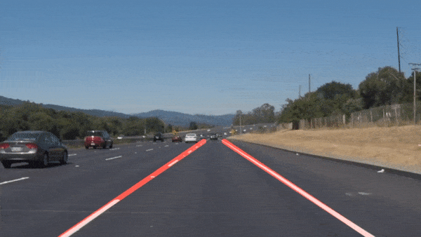

# Lane Detection

This is a Python script that detects lanes in an image using the Canny edge detection algorithm and the Hough transform.

## Install

To use this script, you need to have Python 3 and OpenCV installed on your computer.

You can run the script with the following command:

pip install opencv-python

## Usage

To run the lane detection algorithm on an image, run the following command:

python lane_detection.py

